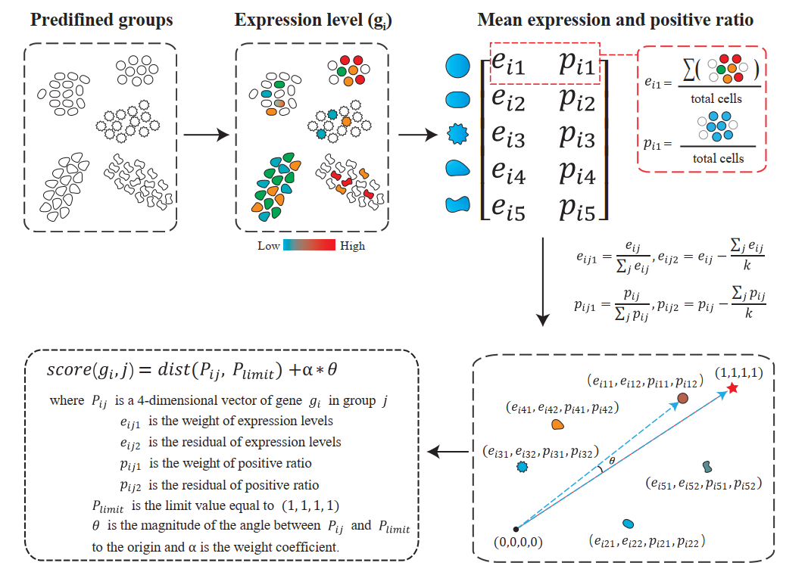

# A Robust Marker Gene Selection by Harmonizing Expression Levels and Positivity Rates in Single-Cell Resolution Transcriptome
[](https://www.python.org/)
[](https://opensource.org/license/gpl-3-0/)

Cell type classification is a crucial stage in single-cell and spatial transcriptome analysis. Romeo, which stands for **ro**bust **m**arker identifier with **e**xpression levels and positive rati**o**, is a valuable tool for precisely and reliably identifying marker genes. Its efficiency in identifying biologically significant marker genes quickly makes it an indispensable asset for enhancing our comprehension of cellular diversity and function.



# Installation

```
pip install git+https://github.com/BrainStOrmics/Romeo.git
```

# Usage

The [Romeo tutorials](https://github.com/BrainStOrmics/Romeo/tree/main/tutorials/Romeo_tutorials.ipynb) provides a quick-start guide based on the pbmc3k dataset.

# Enviroments
- python>=3.8.0
- numpy>=1.18.0
- pandas>=0.25.1
- scanpy>=1.9.0
- scipy>=1.9.0
- anndata>=0.8.0
- scikit-learn>=0.19.0

# Question

For questions about the code and tutorial, please contact Qianhua ZHU, zhuqianhua@genomics.cn.

# Citation
If Romeo is useful for your research, please consider citing.